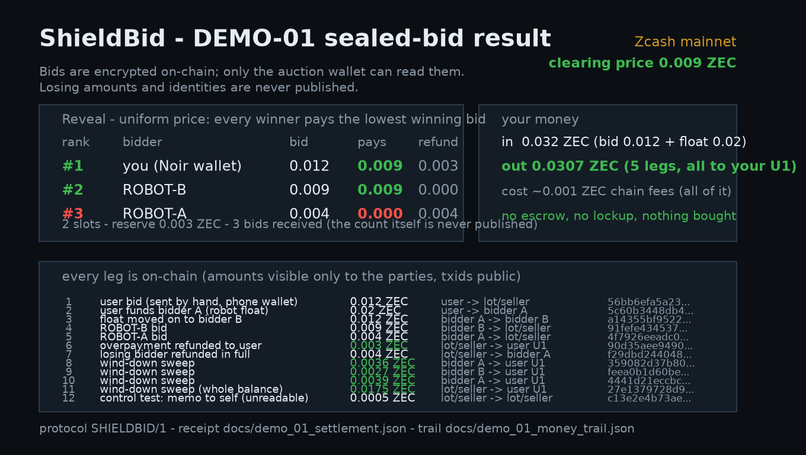

# ShieldBid — sealed-bid auctions on Zcash

**ZECATHON · track: PRIVATE MARKETS**

> *"The price should be public and the participants should not."*

ShieldBid runs a sealed-bid auction where **the bid is a shielded Zcash transfer** — the amount you
send *is* your bid, encrypted end-to-end, readable only by the seller. When the window closes the
seller publishes **the clearing price and the ranking — nothing else**. Nobody on chain ever learns
what you bid, who you are, or even how many people took part.

Not another auction site. A missing privacy layer that any auction site can drop in.

**This is not a mock-up: the repository ships a complete round that settled on Zcash mainnet**, 12
mined transactions, real ZEC, receipts for every leg — see [DEMO-01](#demo-01--a-real-round-on-zcash-mainnet).

---

## Why this exists

On the marketplace this was built against, bids are a **public open book** — anyone can read every
offer and raise the price against you:

| Observation (measured 2026-09-29) | Value |
|---|---|
| Open offers visible on the public bid book | 16 offers · top **3.38 ZEC** · **22.71 ZEC** total (≈ $34,928) |
| Auction wording on that same page | *"existing bids can be viewed or raised at any time before the auction ends"* |
| What a participant wrote afterwards | *"after analysing other people's bid amounts for 7 hours, I finally submitted my bid"* |

Price discovery happens on a public wall. A sealed round puts each bidder's price back inside an
encrypted note: unlinkable, unreadable, and settled on the same chain.

---

## How it works (protocol `SHIELDBID/1`)

1. **Lot published** — item, public reserve price, deadline (UTC), and one **unified address (UA)**
   owned by the seller.
2. **Bid = one shielded → shielded transfer.** The transferred **amount is the bid**. There is no
   bid string to parse and no wallet support to depend on; the amount is already encrypted by the
   protocol. (`memo` is accepted and shown in the UI purely as decoration.)
3. **No public book.** No amount, no bidder, no bid count is visible to a third party. An explorer
   sees `shielded → shielded` and nothing else.
4. **Commitment at the deadline.** The seller freezes its inbox at a published block height and
   publishes `SHA-256` over the sorted set of received notes — before any amount is revealed.
5. **Reveal.** The seller publishes the clearing price, the ranking, the count, and the receipt list
   (txids + amounts + status). Each bidder checks **their own txid** is in the list.
6. **Settlement.** Winners pay the **uniform clearing price** (the lowest winning bid); the
   overpayment comes back, losers are refunded **in full**, both as shielded payments — so even "this
   address lost" stays hidden.

Everything is CLI-reproducible: `tools/engine.py` talks to a local
[`zkool_graphql`](docs/ENGINE_SETUP.md) light-client engine over loopback; no third-party service is
trusted with keys or amounts.

---

## DEMO-01 — a real round on Zcash mainnet

Round closed **2026-09-28T18:37:46Z** at height **3,499,452**. 3 sealed bids, 2 slots, reserve
0.003 ZEC. The human bid was sent **by hand from a phone wallet** (Noir) — the two others by the
repo's own CLI. Nothing of the user's money is left in any demo wallet.

| # | Bidder | Bid | Result | Pays | Refunded |
|---|---|---|---|---|---|
| 1 | human, from a phone wallet | 0.012 | **win** | 0.009 | 0.003 |
| 2 | ROBOT-B (CLI) | 0.009 | **win** | 0.009 | — |
| 3 | ROBOT-A (CLI) | 0.004 | lose | 0 | 0.004 |

**Clearing price 0.009 ZEC** = the lowest winning bid (uniform price). Money in `0.032` → out
`0.0307`, chain fees ≈ `0.001 ZEC` (≈ $1.5) for the whole round.

### Every leg is on chain (12/12 mined)

| # | What | ZEC | From → To | txid | Height |
|---|---|---|---|---|---|
| 1 | human's bid for lot 001 | 0.012 | wallet → lot UA | `56bb6efa5a23…` | 3,499,413 |
| 2 | funding the demo bidders | 0.020 | user → bidder A | `5c60b3448db4…` | 3,499,430 |
| 3 | top-up to bidder B | 0.012 | bidder A → bidder B | `a14355bf9522…` | 3,499,438 |
| 4 | ROBOT-B sealed bid | 0.009 | bidder B → lot UA | `91fefe434537…` | 3,499,451 |
| 5 | ROBOT-A sealed bid | 0.004 | bidder A → lot UA | `4f7926eeadc0…` | 3,499,451 |
| 6 | overpayment returned | 0.003 | lot UA → user | `90d35aee9490…` | 3,499,452 |
| 7 | loser refunded in full | 0.004 | lot UA → bidder A | `f29dbd244048…` | 3,499,454 |
| 8 | wind-down sweep | 0.0036 | bidder A → user | `359082d37b80…` | 3,499,454 |
| 9 | wind-down sweep | 0.0027 | bidder B → user | `feea0b1d60be…` | 3,499,454 |
| 10 | wind-down sweep | 0.0039 | bidder A → user | `4441d21eccbc…` | 3,499,462 |
| 11 | lot remainder swept | 0.0175 | lot UA → user | `27e1379728d9…` | 3,499,462 |
| 12 | memo-carry experiment (finding #1 below) | 0.0005 | lot UA → lot UA | `c13e2e4b73ae…` | 3,499,418 |

Machine-readable receipts, not hand-typed:

| File | What it is |
|---|---|
| `docs/demo_01_transactions.json` | every leg **read back from the engine's `transactionsByAccount`** |
| `docs/demo_01_settlement.json` | the reveal: clearing price, ranking, commit/salt per bid |
| `docs/demo_01_money_trail.json` | the money path in / out |
| `docs/demo_01_seller_view.json` | what the seller's own wallet decrypted |
| `docs/demo_01_ledger.json` | bidder receipts + commitments |
| `docs/DEMO_01_REPORT.md` | the full write-up, including the honest limits |



### Two findings the round produced

1. **The memo cannot carry a bid — so the amount carries it.** A *received* orchard note reads back
   `memo = null` and `memosByTransaction` returns `[]` on engine v6.31.0: the node does not hand the
   memo to the wallet. The protocol was redesigned around **escrow-as-bid** (the amount is the bid),
   which is strictly better — no memo convention to agree on, no wallet support needed, and the
   amount is ciphertext by construction.
2. **A fresh outbound payment needs a fresh account sync.** Paying twice in a row from one wallet
   without `synchronizeAccount` in between makes the node reject the tx
   (`could not contextually validate` — the wallet was still offering a note it had just spent).
   `demo_01_run.pay()` now syncs before every attempt, so retries self-heal.

---

## Quick start (three commands)

```bash
bash tools/engine_up.sh                       # start the local light-client engine (mainnet + testnet)
# 1) seller: show the lot address that bidders pay
python tools/engine.py addresses --net mainnet --account 1
# 2) bidder: place a sealed bid (amount = your price)
python tools/engine.py bid --net mainnet --account 2 --to <lot-ua> --amount 0.01
# 3) seller: sync, then read the sealed bids / close the round
python tools/engine.py sync --net mainnet --account 1 --balance
python tools/engine.py bids --net mainnet --account 1 --json
```

A bidder with any shielded Zcash wallet (Zodl/Zashi, Ywallet, Edge, Zkool, Zingo!, Nighthawk, Noir) needs **no tooling at all**:
send the amount to the lot address. See `docs/BIDDER_GUIDE.md`.

Engine setup, GraphQL cheat-sheet and the pitfalls that cost real time are in
`docs/ENGINE_SETUP.md`.

---

## Repo layout

```
web/index.html              the public lot board (single file, no backend)
docs/SPEC.md                protocol spec SHIELDBID/1, incl. the threat model
docs/BIDDER_GUIDE.md        wallet-level instructions for bidders
docs/DEMO_01_REPORT.md      the mainnet round: receipts + honest limits
docs/ENGINE_SETUP.md        local zkool_graphql engine: setup, GraphQL, pitfalls
tools/engine.py             wallet CLI: height/accounts/addresses/balance/sync/notes/bids/bid/send/newaccount/shield/validate
tools/demo_01_run.py        drives a full round: status/fund/bid/close/refund
tools/demo_01_finish.py     wind-down: close → refund → sweep (idempotent)
tools/*_card.py             the PNG result/status/roadmap cards used in this README
tools/watch_bids.py         poll the lot UA for newly received notes
```

---

## Honest limits (stated, not hidden)

* **No live "current high bid" exists.** Amounts are encrypted, so the seller *cannot* honestly
  publish a standing price during the round. We do not fake one.
* **The seller is a trusted party.** It can decrypt from the first block, and it can lie about the
  arithmetic behind the published clearing price. Third parties **cannot** recompute it from chain
  data alone — that is the price of privacy. What a bidder *can* do is prove what it bid: every bid
  carries a commit/salt record (`docs/demo_01_ledger.json`), and every revealed bid must be backed
  by a real txid paying the lot address.
* **A sent shielded transfer is final.** A bidder cannot retract a bid after the deadline, so a bid
  must be a price it is happy to pay.
* **Custody is the seller's** until refunds are broadcast. Mitigation: the seller publishes the
  refund batch txids.
* **The asset itself is out of scope.** Zcash has no live mainnet asset/NFT standard, so the lot's
  item is referenced off-chain by id/URI. ShieldBid settles the *price discovery*.
* **Escrow-as-bid means the bid amount is visible to whoever holds the lot keys.** That is inherent
  to the design and stated in `docs/SPEC.md` §7.

---

## Independence

An independent ZECATHON submission. Not affiliated with, and not repackaging, any existing product;
the public bid book referenced above is cited only as evidence that the problem is real.

MIT licensed — see `LICENSE`.

---

<details>
<summary><b>中文速览（给中文读者）</b></summary>

**一句话**：ShieldBid 把「密封竞价拍卖」做成了 Zcash 上的一次屏蔽转账 —— **你打的金额就是你的出价**，
全程加密，只有卖家能看见；截止后只公布**清算价 + 名次**，输家的金额和身份永不公开。

**为什么需要它**：现在的公开竞价台把每个人的出价摊在桌面上（实测同一页面 16 笔公开挂单、总额
22.71 ZEC），有人明说"分析了别人出价 7 小时后才敢报"。密封竞标把这一步锁进密室。

**真的跑过**：`DEMO-01` 在 Zcash **主网**完成一整轮 —— 3 笔密封出价、2 个名额、清算价 0.009 ZEC；
一笔是真人用手机钱包手动发的。12 笔链上交易全部上链，逐笔 txid 见
`docs/DEMO_01_REPORT.md`。全轮花的链上手续费约 0.001 ZEC（≈$1.5）。

**诚实的局限**（写进 SPEC，不藏）：没有"实时最高价"这种东西（金额加密，卖家也做不到）；
卖家是受托方，可以谎报清算价，第三方无法验算（这是隐私的代价）；出价一旦发出不可撤回。

</details>
